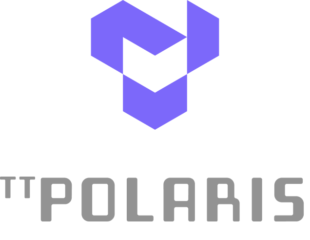

[](https://www.python.org/downloads/release/python-3132/)

<!-- 
  
  [](./__ci/html/index.html)
-->

<div align="center">

<picture>

</picture>

<p>
Yet Another High Level AI Simulator
</p>

</div>

----

## Table of Contents
- [Introduction](#introduction)
- [Installation](#installation)
  - [Prerequisites](#prerequisites)
  - [Environment Setup](#environment-setup)
    - [User Environment](#user-environment)
    - [Developer Environment](#developer-environment)
- [Usage](#usage)
  - [Basic Command Structure](#basic-command-structure)
  - [Configuration Files](#configuration-files)
  - [Output and Analysis](#output-and-analysis)
  - [Best Practices](#best-practices)
  - [Troubleshooting](#troubleshooting)
- [Support](#support)

## Introduction
*polaris* is a high level simulator for performance analysis of AI architectures. It takes as input an *AI Workload* and an *Architecture Configuration*. It represents the input workload into an in-memory directed acyclic graph (DAG) data structure, where each node represents a *computation* or a *communication* operator, and each edge represents a *dataflow*. The graph data structure represents an *intermediate representation* (IR) for the Simulator virtual machine (VM). We can execute various graph transformations, and eventually schedule the DAG on a *backend* for performance analysis.

## Installation

### Prerequisites
- Python 3.13 or higher
- Miniforge package manager

### Environment Setup
The recommended setup uses Python with the Miniforge installation manager. It is expected that the reader is familiar with conda environments, creating and switching between environments. One can familiarize oneself with these concepts at [Conda Getting Started](https://docs.conda.io/projects/conda/en/latest/user-guide/getting-started.html).

#### Installing Miniforge
1. Download and install Miniforge as described in the [Miniforge Installation Instructions](https://github.com/conda-forge/miniforge):
   ```bash
   curl -L -O "https://github.com/conda-forge/miniforge/releases/latest/download/Miniforge3-$(uname)-$(uname -m).sh"
   bash Miniforge3-$(uname)-$(uname -m).sh
   ```
2. Update conda:
   ```bash
   conda update -n base -c conda-forge conda
   ```

#### User Environment Setup
1. Create and activate the Polaris environment. The conda environment will
   be created with the name 'polaris'. If you wish to provide a different name to the environment, run the command
   `conda env create --file environment.yaml --name <name-of-your-choice>` instead.
   ```bash
   conda env create --file environment.yaml
   conda activate polaris
   ```

#### Developer Environment Setup
1. Create and activate the development environment. The conda environment will
   be created with the name 'polarisdev'. If you wish to provide a different name to the environment, run the command
   `conda env create --file envdev.yaml --name <name-of-your-choice>` instead.
   ```bash
   conda env create --file envdev.yaml
   conda activate polarisdev
   ```
2. Install pre-commit hooks:
   ```bash
   pre-commit install
   ```

## Usage

### Basic Command Structure
```bash
python polaris.py [options] --archspec <arch_config> --wlspec <workload_spec> --wlmapspec <mapping_spec>
```

### Key Command Line Options
- `--archspec,    -a`: Path to architecture specification YAML file
- `--wlspec,      -w`: Path to workload specification YAML file
- `--wlmapspec,   -m`: Path to workload mapping specification YAML file
- `--study,       -s`: Name for the simulation study (default: "study")
- `--odir,        -o`: Output directory for results (default: ".")
- `--outputformat`: Output format for results (none/yaml/json/pickle)
- `--dump_stats_csv`: Enable CSV stats output
- `--dryrun,      -n`: Perform a dry run without actual simulation
- `--enable_memalloc`: Enable memory allocation simulation
- `--instr_profile`: Enable instruction profiling
- `--enable_cprofile`: Enable Python cProfile for performance analysis

### Filtering Options
- `--filterarch`: Filter architecture configurations
- `--filterwlg`: Filter workload groups
- `--filterwl`: Filter specific workloads
- `--filterwli`: Filter workload instances

### Configuration Files

#### Architecture Specification
The architecture specification file (`archspec`) defines the hardware configuration including:
- Device specifications
- Memory hierarchy
- Compute resources
- Clock frequencies

#### Workload Specification
The workload specification file (`wlspec`) defines:
- AI model configurations
- Batch sizes
- Input/output specifications
- Operator configurations

#### Workload Mapping Specification
The workload mapping specification file (`wlmapspec`) defines:
- Operator to datatype mappings
- Resource requirements
- Operator fusion rules
- Null operations

### Output and Analysis

#### Output Formats
Polaris supports multiple output formats:
- YAML: Human-readable structured format
- JSON: Web-friendly format
- Pickle: Binary format for Python objects
- CSV: Tabular format for statistics

#### Key Metrics
The simulation provides various performance metrics including:
- Execution cycles and time
- Memory usage and requirements
- Resource bottlenecks
- Input/output parameter counts
- Resource utilization

#### Output Directory Structure
```
output_dir/
├── study_name/
│   ├── SUMMARY/
│   │   └── study-summary.csv
│   └── stats/
│       ├── device-workload-stats.csv
│       └── device-workload-opstats.[yaml|json|pickle]
```

### Best Practices
1. Start with a dry run using `--dryrun` to validate configurations
2. Use filtering options to focus on specific architectures or workloads
3. Enable CSV output for easy data analysis
4. Use appropriate output formats based on your needs:
   - YAML for human readability
   - JSON for web integration
   - Pickle for Python processing
5. Monitor memory requirements using `--enable_memalloc`

### Troubleshooting

#### Common Issues
1. Memory Constraints
   - Use `--enable_memalloc` to check memory requirements
   - Verify device memory specifications
   
2. Performance Issues
   - Enable profiling with `--enable_cprofile`
   - Check resource bottlenecks in output statistics

3. Configuration Errors
   - Validate YAML syntax in specification files
   - Use `--dryrun` to check configurations
   - Verify file paths and permissions

## Support
For issues and questions:
- Check the project repository: https://github.com/tenstorrent/polaris
- Review existing issues or create new ones
- Consult the development team for advanced support

