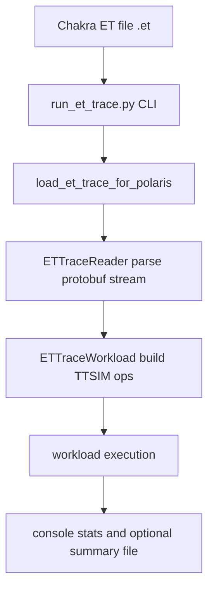

# Chakra ET Trace Tools

## Overview

This document describes the Chakra ET trace support scripts introduced for Polaris, including what each script/module does, what inputs it expects, and what outputs it produces.

The current ET flow supports direct ingestion of Chakra `.et` traces into Polaris/TTSIM without a YAML conversion step.

## Scope

This documentation covers:

- `generate_chaktra_et_from_ttsim.py`
- `run_et_trace.py`
- `ttsim/front/et_trace/et_reader.py`
- `ttsim/front/et_trace/__init__.py`
- `ttsim/front/chakra/protolib.py`
- `ttsim/front/chakra/et_def_pb2.py`

Reference sample ET files are available under `workloads/chakra/`.

## ET Flow Summary



## Script and Module Inventory

| Path | Type | Purpose | Primary Inputs | Primary Outputs |
|------|------|---------|----------------|-----------------|
| `generate_chaktra_et_from_ttsim.py` | CLI script | Generate Chakra ET trace files from TTSIM graph/workload data | TTSIM-derived op/graph data, CLI export options, optional output path controls | Chakra `.et` files (protobuf stream), optional export summary/log output |
| `run_et_trace.py` | CLI script | Execute one or more Chakra ET traces with Polaris/TTSIM | CLI flags (`--et-file` / `--et-dir`, device, shape knobs), environment (`SIMGALAXY_ROOT`) | Console report, process exit code, optional `et_trace_summary.txt` files |
| `ttsim/front/et_trace/et_reader.py` | Library module | Parse ET protobuf stream and build `ETTraceWorkload` | ET file path, optional `batch_size`, `seq_len` | `ETTraceReader`, `ETTraceWorkload`, runtime stats/results |
| `ttsim/front/et_trace/__init__.py` | Package entrypoint | Re-export ET frontend API symbols | Python import (`from ttsim.front.et_trace import ...`) | Exported symbols (`ETTraceWorkload`, `ETTraceReader`, `load_et_trace_for_polaris`) |
| `ttsim/front/chakra/protolib.py` | Utility module | Low-level protobuf varint framing and message IO helpers | Binary file handle/path and protobuf message instances | Decoded message objects / encoded protobuf stream bytes |
| `ttsim/front/chakra/et_def_pb2.py` | Generated protobuf module | Chakra ET schema definitions (`Node`, enums, attributes, tensors) | Imported by readers/parsers | Python protobuf classes and enums for ET messages |

## Detailed Script Documentation

## 1) `generate_chaktra_et_from_ttsim.py`

### What it does

- Provides a CLI export path from TTSIM-side graph/workload representation to Chakra ET format.
- Translates TTSIM operation metadata into Chakra ET node records.
- Writes protobuf-framed Chakra `.et` files that can be consumed by ET-based workflows.

### Expected inputs

#### CLI arguments

Expected argument classes (exact flag names depend on script implementation):

- TTSIM source input (for example: graph/workload/model export path)
- ET output destination (single file path or output directory)
- Optional naming/filter knobs for which ops/nodes are exported
- Optional metadata knobs (batch/sequence/model labels, timestamps, tags)

#### Data assumptions

- Source data contains enough op-level information to construct Chakra ET nodes:
  - node id/name/type
  - dependency edges
  - optional runtime/FLOP/tensor-size style metadata

### Outputs

#### Files written

- Chakra ET protobuf stream file(s), typically with `.et` extension.

#### Runtime output

- Console/log summary of exported node count and output locations.
- Non-zero exit on export/serialization failure.

## 2) `run_et_trace.py`

### What it does

- Provides a command-line interface to run Polaris on Chakra ET traces.
- Supports:
  - single-trace mode (`--et-file`)
  - batch mode (`--et-dir` + `--pattern`)
- Loads traces through `ttsim.front.et_trace.load_et_trace_for_polaris`.
- Prints workload statistics (op count, layer count, FLOPs, memory estimate).
- Optionally writes per-trace summary text files.

### Expected inputs

#### CLI arguments

**Required (mutually exclusive):**
- `--et-file <PATH>`: path to one ET file, or
- `--et-dir <PATH>`: directory containing ET files

**Optional:**
- `--device {wormhole_b0,blackhole,grayskull}` (default: `wormhole_b0`)
- `--batch-size <INT>` (default: `8`)
- `--seq-len <INT>` (default: `2048`)
- `--output-dir <PATH>` (optional output location)
- `--pattern <GLOB>` (batch mode only, default: `*.et`)

#### Environment

- `SIMGALAXY_ROOT` (optional). If unset, script falls back to `~/SimGalaxy`.

#### File dependencies

- ET files containing Chakra protobuf node stream.
- Optional device YAML under `config/<device>.yaml` (falls back to `config/wormhole_b0.yaml` if missing).

### Outputs

#### Runtime output

- Human-readable console report:
  - ET file/device/shape parameters
  - op/layer/FLOP/memory stats
  - per-op-type counts
  - execution success/failure

#### Files written

If `--output-dir` is set:
- `<output-dir>/et_trace_summary.txt` (single mode)
- `<output-dir>/<trace_stem>/et_trace_summary.txt` (batch mode)

Summary content includes:
- ET file path
- target device
- compute-op count
- layer count
- total FLOPs

#### Process return code

- `0` on success
- `1` on top-level failure

## 3) `ttsim/front/et_trace/et_reader.py`

### What it does

Implements ET parsing and workload construction in three layers:

1. `ETNode` wraps raw protobuf node fields with convenience properties.
2. `ETTraceReader` reads varint-length-prefixed protobuf records from `.et` files.
3. `ETTraceWorkload` converts parsed compute nodes into Polaris/TTSIM ops and exposes execution/stat APIs.

### Expected inputs

#### `ETTraceReader(et_file: str)`

- `et_file`: path to a Chakra `.et` binary trace.

Expected ET record format:
- Protobuf varint32 message length
- serialized `Node` payload (as defined in `et_def_pb2`)

#### `ETTraceWorkload(et_file: str, batch_size: int = 8, seq_len: int = 2048)`

- `et_file`: path to ET file
- `batch_size`: shape hint for fallback dimension estimation
- `seq_len`: shape hint for fallback dimension estimation

Additional runtime expectations:
- Chakra protobuf schema import must be resolvable
- TTSIM functional APIs must be importable

### Outputs

#### Data structures

- `ETTraceReader.nodes`: ordered list of parsed `ETNode`
- `ETTraceReader.node_map`: node id to node mapping
- `ETTraceWorkload.layers`: grouped nodes by inferred layer index
- `ETTraceWorkload.ops`: Polaris op descriptors created from ET nodes

#### Runtime methods

- `workload()`: executes supported constructed ops and returns result tensors list.
- `workload.get_stats()`: dictionary containing:
  - `total_compute_ops`
  - `total_layers`
  - `ops_by_type`
  - `total_flops`
  - `total_memory`

#### Behavior notes

- Operation type is inferred from node name patterns.
- MatMul dims are estimated from ET metadata when available; fallback heuristics are used otherwise.
- Unsupported or placeholder op classes are currently tracked but not fully executed.

## 4) `ttsim/front/et_trace/__init__.py`

### What it does

- Defines package-level exports for ET frontend users.
- Keeps import surface stable:
  - `ETTraceWorkload`
  - `ETTraceReader`
  - `load_et_trace_for_polaris`

### Expected inputs

- Standard Python imports from code that wants ET functionality.

### Outputs

- Exposed symbols via `__all__` and package import path.

## 5) `ttsim/front/chakra/protolib.py`

### What it does

Provides helper functions for protobuf message stream IO:

- `openFileRd(in_file)`: open plain or gzip-compressed protobuf files.
- `_DecodeVarint32(in_file)`: decode 32-bit varint message length.
- `decodeMessage(in_file, message)`: read one framed protobuf message.
- `_EncodeVarint32(out_file, value)`: encode varint length prefix.
- `encodeMessage(out_file, message)`: write one framed protobuf message.

### Expected inputs

- Binary file path/handles.
- Protobuf message objects with `ParseFromString` and `SerializeToString`.

### Outputs

- File handles configured for binary read.
- Decoded message population into provided protobuf object.
- Encoded framed protobuf stream for writer use-cases.
- Boolean success/failure indicator for `decodeMessage`.

## 6) `ttsim/front/chakra/et_def_pb2.py`

### What it does

- Generated protobuf bindings for Chakra ET schema (`et_def.proto`).
- Defines message types (such as `Node`, `AttributeProto`, `Tensor`) and enums (such as `NodeType`).

### Expected inputs

- Imported by ET readers/parsers that need schema class definitions.

### Outputs

- Runtime protobuf classes for ET encode/decode operations.

## End-to-End Usage Example

```bash
# Single ET file
python run_et_trace.py \
  --et-file workloads/chakra/bert_base_tp1_dp1_bs1_seq512/bert_base.0.et \
  --device wormhole_b0 \
  --batch-size 1 \
  --seq-len 512 \
  --output-dir __et_out/bert_base
```

```bash
# Batch ET directory
python run_et_trace.py \
  --et-dir workloads/chakra/llama70_4x8_tp32_bs1_seq1 \
  --pattern "llama70_decode_tp32.*.et" \
  --device wormhole_b0 \
  --output-dir __et_out/llama70
```

## Troubleshooting

### Common issues

- **`SIMGALAXY_ROOT` not set / Chakra import failure**
  - Set `SIMGALAXY_ROOT` to your SimGalaxy checkout path.
- **No ET files found in batch mode**
  - Verify `--et-dir` and `--pattern`.
- **Device config YAML missing**
  - Add the expected `config/<device>.yaml` file or use default available config.
- **Partial op execution**
  - Expected for traces containing op types currently represented as placeholders.

## Related Paths

- `generate_chaktra_et_from_ttsim.py`
- `run_et_trace.py`
- `ttsim/front/et_trace/`
- `ttsim/front/chakra/`
- `workloads/chakra/`
