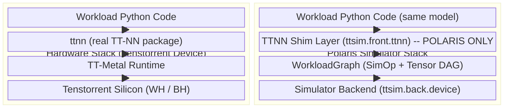

# TTNN Shim — User Guide

A user-oriented overview of Polaris's TTNN shim: what it is, how to write workloads that run both on hardware and under Polaris, what's supported, and what's not.

---

## 1. What and Why

The TTNN shim is a **drop-in replacement** for the real `ttnn` Python package. It lets Polaris simulate the same workload code that runs on Tenstorrent hardware — without requiring any silicon.

Where real `ttnn` dispatches kernels to a device, the shim builds a **graph of operations and tensor metadata** that Polaris later executes through its analytical performance models (and, where available, hardware-profiled lookup data). The shim is loaded **only** under Polaris; on actual hardware, real `ttnn` is loaded instead.

**Important:** Polaris reproduces the *layer sequence and op signatures* a workload would produce on hardware — not the numeric tensor values. If your code branches on actual tensor data, it will not behave the same way under Polaris.

---

## 2. Hardware vs Polaris: Side-by-Side

The shim exists **only** in the Polaris column. On real hardware it is replaced by the actual `ttnn` package and TT-Metal runtime. The shim is **never loaded, imported, or executed** on hardware.



| Aspect | Hardware | Polaris |
|--------|----------|---------|
| `ttnn` import | Real `ttnn` from tt-metal | `ttsim.front.ttnn` (shim) |
| `torch` import | Real PyTorch | `ttsim.front.ttnn.minitorch_shim` |
| Device | Silicon (Wormhole / Blackhole) | Stub `Device` (Python dicts) |
| Execution | Kernels on hardware | Graph construction only |
| Output | Real tensor data | `WorkloadGraph` for simulation |

---

## 3. Writing a Dual-Mode Workload

Same workload code runs both ways. The only difference is the imports at the top of the file:

```python
import os

IS_POLARIS = os.getenv('IRD_ARCH_NAME', '') == ''

if not IS_POLARIS:
    import ttnn                          # real TT-NN on hardware
    import torch                         # real PyTorch
else:
    import ttsim.front.ttnn as ttnn      # shim (POLARIS ONLY)
    import ttsim.front.ttnn.minitorch_shim as torch
```

When `IRD_ARCH_NAME` is set (real TT device environment), kernels execute on silicon. When unset (Polaris), the shim builds a `WorkloadGraph` instead. **The model code below this branch is identical.**

### Workload registration

Workloads are declared in YAML (e.g. `config/all_workloads.yaml`) with an `api: TTNN` entry pointing at your Python module. Each module must expose a function with this signature:

```python
def run_<name>(wlname: str, device, cfg: dict):
    ...
```

For the complete dispatch flow, parameter contract, and a reference implementation, see [`doc/TTNN_WORKLOAD_FLOW.md`](TTNN_WORKLOAD_FLOW.md).

Reference workloads:
- `workloads/ttnn/vit/wh/run_ttnn_optimized_sharded_vit_wh.py` — WH entry point
- `workloads/ttnn/vit/bh/run_ttnn_optimized_sharded_vit_bh.py` — BH entry point
- `workloads/ttnn/vit/common/ttnn_optimized_sharded_vit.py` + `common/ttnn_functional_vit.py` — shared model code consumed by both

---

## 4. Supported Operations

The shim's surface is the union of exports from `op.py`, `__init__.py`, `ttnn_shim.py`, and `experimental.py`. Python function names (`conv2d`) map to ONNX-style SimOp `optype` names (`Conv`) — this distinction matters when looking at profiler output.

| Category | Ops (SimOp `optype` names) |
|----------|---------------------------|
| Unary | `Cos`, `Gelu`, `Identity`, `LeakyRelu`, `Neg`, `Relu`, `Sigmoid`, `Sin`, `Softmax`, `Tanh`, `Clip`, `Log`, `Sqrt`, `Exp`, `Atan` |
| Binary | `Add`, `Sub`, `Mul`, `Div`, `Pow`, `Min`, `Max`, `Where` |
| Reduction | `Mean`, `Sum`, `ArgMax`, `NonZero`, `TopK` |
| Data movement | `Concat`, `Reshape`, `Expand`, `Gather`, `Transpose`, `Split`, `Assign` |
| Normalization | `LayerNormalization`, `BatchNormalization`, `rms_norm` (decomposed) |
| Convolution | `Conv`, `ConvTranspose`, `GlobalAveragePool`, `MaxPool` |
| Linear algebra | `MatMul`, `linear` (fused matmul + optional bias + activation) |
| Attention / NLP | `NLPCreateQKVHeads`, `NLPConcatHeads` |
| Layout | `Tilize`, `Untilize`, `to_layout`, `interleaved_to_sharded`, `reshard`, `to_memory_config` |
| Other | `GridSample`, `Fold`, `MoE`, `Dropout`, `zeros_like`, `clone`, `compare` |

For the full per-op API reference (layout / tilize / shard signatures), see [`doc/ttnn_shims_README.md`](ttnn_shims_README.md).

### Composite ops — what's fused, what's not

- **`linear`** is a single `MatMul` SimOp with optional bias input and a `fused_activation` attr. It is **not** decomposed into separate matmul + add + activation. This matches the hardware profiler output, where the fused kernel appears as one op.
- **`conv2d` / `conv_transpose2d`** are single `Conv` / `ConvTranspose` SimOps with ONNX-style attrs.
- **Attention** is composed by the workload from `nlp_create_qkv_heads` + matmul + softmax + `nlp_concat_heads`. There is no generic "scaled dot product attention" op.
- **`rms_norm`** is decomposed into multiple primitive ops (layer norm + div + mul/add), not a single SimOp.

---

## 5. Tensor Model You Need to Know

### Memory placement and sharding

`MemoryConfig` mirrors tt-metal's class: `MemoryConfig(memory_layout, buffer_type, shard_spec=None)`. `memory_layout` selects between `INTERLEAVED` and sharded variants (`HEIGHT_SHARDED`, `WIDTH_SHARDED`, `BLOCK_SHARDED`); `buffer_type` is `L1` or `DRAM`. Both fields are tracked on each tensor and flow into LUT key construction, so sharded layouts ARE distinguished from interleaved in cycle estimates whenever the LUT covers them. Performance differentiation comes primarily from the LUT (when present); analytical fallback is dtype- and shape-aware but does not deeply model sharding geometry.

`create_sharded_memory_config` constructs an appropriately-sharded `MemoryConfig`. `to_memory_config` (from `ttsim.front.ttnn`) emits `ShardedToInterleaved` + `InterleavedToSharded` SimOps when transitioning between two sharded layouts, mirroring hardware's interleaved staging step.

`Conv2dConfig` carries sharding-related flags for structural parity with tt-metal; the shim auto-emits the `InterleavedToSharded` → `Halo` → `Move` op sequence around `conv2d` / `conv_transpose2d` when these flags indicate sharded operands, so the LUT keys land on the expected entries.

### Logical vs padded shape

`Tensor` maintains two shape representations:

- **`_logical_shape`** — the user-facing shape (e.g. `[1, 197, 768]`)
- **`_padded_shape`** — shape after tile alignment (last two dims rounded up to multiples of 32 for `TILE_LAYOUT`, e.g. `[1, 224, 768]`)

This distinction usually doesn't matter for workload code, but it shows up when comparing Polaris stats CSVs against hardware profiler output: the two may report different shapes depending on whether the logical or padded view is taken at a given point. After `untilize` followed by `set_shape`, Polaris and the profiler may disagree on output shape — this is a known representation difference, not a bug.

### Tensor lifecycle ops are stubs

The shim provides API-compatible stubs for host/device transfer so portable workloads compile. They maintain the call surface but perform no real data movement:

| Operation | Shim behavior | Real hardware behavior |
|-----------|--------------|----------------------|
| `from_torch(t)` | Optionally mutates attributes; returns same object | Transfers data from host to device buffer |
| `to_torch(t)` | Identity (returns tensor as-is) | Transfers data from device back to host |
| `to_device(t, dev)` | Assigns `device` ref, registers tensor | Allocates device buffer, copies data |
| `deallocate(t)` | No-op | Frees device memory |
| `reallocate(t)` | Returns `t` unchanged | Defragments / moves device buffer |
| `synchronize_device(dev)` | No-op | Waits for all device operations to complete |

Memory modeling for performance lives in the graph/LUT layer, not these lifecycle APIs.

---

## 6. PyTorch Replacement (`minitorch_shim`)

A secondary shim layer that replaces PyTorch so Polaris workloads have zero dependency on real PyTorch:

- Provides a minimal `torch` API subset: dtypes (`float32`, `bfloat16`), `manual_seed` (no-op), basic tensor construction
- Imported as `import ttsim.front.ttnn.minitorch_shim as torch` in Polaris mode (see §3)
- Lets workloads that interleave `torch` and `ttnn` calls run under Polaris without installing PyTorch

If your workload uses a `torch` API that isn't in the minitorch shim, you may need to extend it — but most workloads only need a small surface.

---

## 7. Known Gaps and Limitations

**Captured faithfully by the shim:**
- Op sequence (the order ops appear in the graph)
- Op type and signature (`optype`, `attrs` dict)
- Tensor shapes (logical + padded), dtypes, layouts (`ROW_MAJOR` / `TILE`)
- Memory config (DRAM / L1)
- Data-flow edges between ops

**Known gaps — places where Polaris may differ from hardware:**
- Some dtype promotions that happen inside HW kernels (e.g. `BFLOAT8_B`)
- Certain implicit layout changes the real runtime inserts
- Exact padding / `set_shape` semantics after untilize
- Singleton dimension differences (3D vs 4D) between shim and profiler output — `compare_layers.py --strip-singleton-dims` is the standard mitigation

These gaps generally show up as comparison artifacts, not as runtime errors. When numbers don't match, this is the first list to check.

---

## 8. Where to Go Next

- **Layout / tilize / shard API reference**: [`doc/ttnn_shims_README.md`](ttnn_shims_README.md).
- **System-wide architecture** (CLI, frontends, backend, profiling tools, LUT wiring): [`doc/overview.md`](overview.md).
- **Workload dispatch flow**: [`doc/TTNN_WORKLOAD_FLOW.md`](TTNN_WORKLOAD_FLOW.md).
- **Running Polaris** (CLI flags, study setup, output formats): [`doc/user_guide.md`](user_guide.md).
